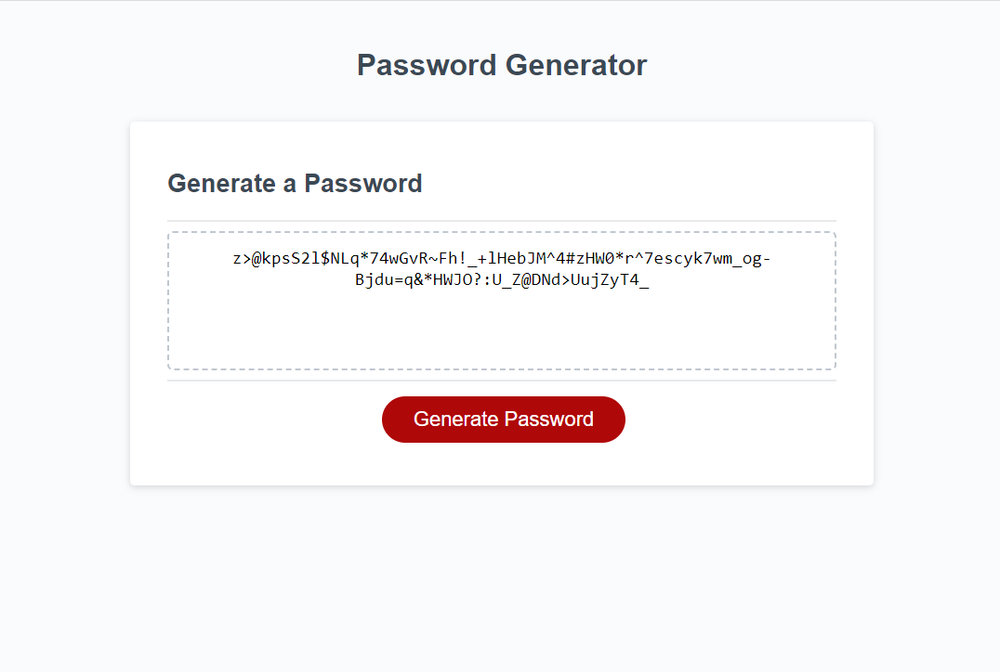

# Random-Password-Generator

## Description

This web application is a random password generator. Based off user input, it generates a custom password that contains randomized characters.

This project helped me work with javascript for the first time and create something based on user input. Throughout this project, I was able to define variables, create functions, use if statements and for loops, all in order to generate a custom password based on user input.

## Instalation

This entire project was made in Visual Studio. We were provided starting code from the UCSD Extended Studies Coding Bootcamp, which I inserted into a github repository and then made changes to. 

## Usage

The final product looks like this:

If you click the red Generate Password button, your custom password will be generated after your user input is provided.

Here is a link to the completed web application:

https://cjfeagin33.github.io/Random-Password-Generator/

## Credit

This application was built with assistance from my peers and instructors within the UCSD Extended Studies Coding Bootcamp.